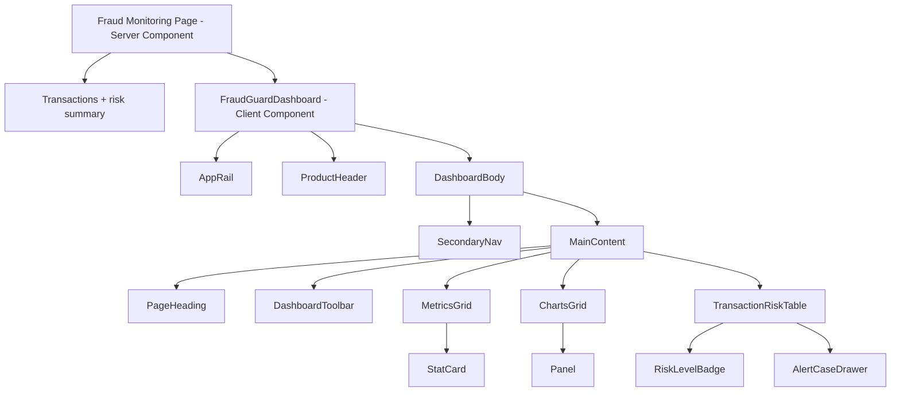
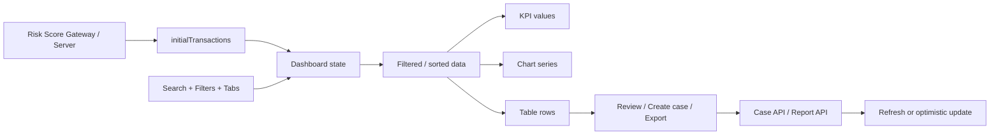

# FraudGuard Dashboard UI System Specification

**Phiên bản:** 1.0  
**Phạm vi:** SaaS đa tenant phát hiện giao dịch bất thường cho SME  
**Tech stack mục tiêu:** React, Next.js App Router, TypeScript, CSS Modules  
**Tài liệu liên quan:** `FRAUDGUARD_DASHBOARD_UI_GUIDE_NEXTJS.md`, proposal `FraudGuard-as-a-Service`

---

## 1. Mục tiêu hệ thống giao diện

Tài liệu này là nguồn quy chuẩn chung cho designer và frontend developer khi xây dựng FraudGuard. Giao diện phục vụ bốn nhóm người dùng: Platform Admin, SME Admin, Risk/Operation Staff và Viewer/Auditor.

- Hệ thống màu, chữ, khoảng cách, kích thước và trạng thái.
- Cấu trúc tổng thể của dashboard.
- Đặc tả từng component và contract giữa các component.
- Quy tắc hiển thị dữ liệu, bảng và biểu đồ.
- Hành vi responsive, loading, error và empty state.
- Quy tắc accessibility và tiêu chí nghiệm thu.

Mục tiêu trải nghiệm:

1. Người dùng nhận ra transaction rủi ro cao, alert và case cần xử lý trong vài giây.
2. Người dùng đi từ tổng quan tới transaction, evidence và case trong tối đa ba thao tác.
3. Filter và trạng thái điều hướng luôn dễ nhận biết.
4. Mật độ dữ liệu cao nhưng không làm mất phân cấp thị giác.
5. Giao diện hoạt động ổn định từ mobile tới màn hình desktop lớn.
6. Mỗi kết quả hiển thị rõ nguồn chấm điểm `AI`, `RULE` hoặc `RULE_FALLBACK`.
7. UI duy trì human oversight: không tự động hủy giao dịch hoặc khóa tài khoản.

### Phạm vi nghiệp vụ chuẩn

| Miền | Nội dung UI |
|---|---|
| Multi-tenancy | Workspace, project, member, role, plan, quota và tenant isolation |
| Onboarding | Trạng thái Draft, Reviewing, Confirmed, Active; đặc tả và custom field đã xác nhận |
| Ingestion | REST API, CSV/Excel, validation result, idempotency và processing status |
| Scoring | Risk score 0–100, risk level, confidence, scoring source, explanation |
| Rule Engine | Conditions, AND/OR groups, risk point, threshold, enable/disable, history |
| Alert & Case | Alert vượt ngưỡng, assignment, notes, timeline và kết luận của con người |
| Reporting | Dashboard, filter, CSV/PDF export và audit trail |
| Platform health | Backend, AI Service, queue, database, error và fallback usage |

---

## 2. Nguyên tắc thiết kế

| Mã | Nguyên tắc | Quy tắc áp dụng |
|---|---|---|
| DG-01 | Ưu tiên dữ liệu | KPI, rủi ro và phát hiện bảo mật xuất hiện trước nội dung giải thích dài. |
| DG-02 | Màu có ý nghĩa | Đỏ chỉ dùng cho Critical/error, cam cho High/warning, xanh lá cho success/healthy, xanh dương cho action/navigation. |
| DG-03 | Phân cấp bằng độ sáng | Nền tổng thể tối nhất, panel sáng hơn một cấp, control sáng hơn panel khi tương tác. |
| DG-04 | Mật độ có kiểm soát | Bảng và chart được phép dày thông tin; khoảng cách và đường viền phải giúp phân nhóm rõ. |
| DG-05 | Trạng thái minh bạch | Mọi filter, tab, loading, empty và error state phải được thể hiện rõ. |
| DG-06 | Progressive disclosure | Dashboard hiển thị tổng quan trước; chi tiết mở qua drawer, modal hoặc trang riêng. |
| DG-07 | Responsive theo tác vụ | Trên mobile, giữ lại thao tác quan trọng; ẩn hoặc gom navigation thứ cấp. |
| DG-08 | Accessible by default | Không dùng màu làm tín hiệu duy nhất; mọi control dùng được bằng bàn phím. |
| DG-09 | Nhất quán hơn trang trí | Dùng token, component chung và pattern có sẵn thay vì tạo style riêng cho từng màn hình. |
| DG-10 | Phản hồi nhanh | Tương tác local phản hồi ngay; thao tác server có loading và success/error feedback. |

---

## 3. Kiến trúc UI



Luồng dữ liệu:



---

## 3.1 Information architecture của FraudGuard

| Navigation | Route đề xuất | Nội dung | Actor |
|---|---|---|---|
| Overview | `/fraud-monitoring` | KPI, risk distribution, trend, scoring source, open alert/case | SME Admin, Risk Staff, Viewer |
| Transactions | `/transactions` | Danh sách transaction, validation status và scoring result | SME Admin, Risk Staff, Viewer |
| Alerts | `/alerts` | Alert vượt threshold và evidence | SME Admin, Risk Staff, Viewer |
| Cases | `/cases` | Assignment, notes, timeline và kết luận | SME Admin, Risk Staff, Viewer read-only |
| Rules | `/rules` | Rule template, conditions, point, threshold, publish history | SME Admin, Platform/Technical Staff |
| Projects | `/projects` | Project, specification, custom field, API key, quota | SME Admin |
| Reports | `/reports` | CSV/PDF export theo phạm vi quyền | SME Admin, Risk Staff, Viewer |
| Platform | `/platform` | SME account, plan, usage, health và global audit | Platform Admin |

### Permission matrix tối thiểu

| Khả năng | Platform Admin | SME Admin | Risk Staff | Viewer/Auditor |
|---|:---:|:---:|:---:|:---:|
| Xem dashboard của tenant được cấp | Theo support scope | Có | Có | Có |
| Quản lý workspace/project/member | Hỗ trợ | Có | Không | Không |
| Tạo/regenerate/revoke API key | Theo support scope | Có | Không | Không |
| Điều chỉnh rule parameter được cho phép | Tạo/cấu hình ban đầu | Có | Không | Không |
| Xem transaction, score, explanation | Theo support scope | Có | Có | Có |
| Tạo và phân công case | Theo support scope | Có | Có | Không |
| Cập nhật case status và note | Không mặc định | Theo quyền | Có | Không |
| Xem audit log | Toàn hệ thống | Trong tenant | Theo quyền | Read-only |
| Quản lý plan/quota/platform health | Có | Chỉ xem usage/plan | Không | Không |

Backend vẫn là nguồn kiểm soát quyền cuối cùng. Việc ẩn button trên frontend chỉ phục vụ trải nghiệm, không thay thế authorization phía server.

### Contract hiển thị kết quả scoring

Mỗi transaction detail phải hiển thị:

| Field | Yêu cầu UI |
|---|---|
| Risk score | Giá trị 0–100, nổi bật nhưng không dùng như kết luận fraud |
| Risk level | Low, Medium, High hoặc Critical với badge semantic |
| Scoring source | AI, RULE hoặc RULE_FALLBACK; fallback phải được nhấn rõ |
| Confidence | Chỉ hiển thị khi AI trả về; không giả lập cho rule result |
| Evidence | Triggered rules nếu rule-based; explanation/evidence nếu AI-based |
| Model/service version | Hiển thị trong metadata khi source là AI |
| Decision time | Timestamp và timezone |
| Alert/case | Link tới alert/case nếu được tạo |
| Human conclusion | Confirmed Fraud, False Alarm hoặc Resolved do Risk Staff cập nhật |

### Free và Subscription plan

| Nội dung | Free Plan | Subscription Plan |
|---|---|---|
| Primary scoring | Dynamic Rule Engine | AI Risk Scoring |
| Evidence | Triggered rules | Confidence + explanation/evidence |
| Khi AI unavailable | Không áp dụng | Dùng Rule Engine và gắn `RULE_FALLBACK` |
| Risk Score Gateway | Có | Có |
| Alert/case | Có | Có |
| Human oversight | Bắt buộc | Bắt buộc |

UI không được làm cho kết quả fallback trông giống kết quả AI. Khi AI Service lỗi, dashboard Platform Admin cần hiển thị health warning và fallback count; SME Portal chỉ cần thông tin scoring source rõ ràng ở transaction/alert.

### Traceability với functional requirements

| UI capability | Proposal requirement | Thành phần frontend |
|---|---|---|
| Tenant/project-scoped navigation | FR-AUTH-04, FR-ORG-01, FR-ORG-02 | Workspace switcher, route guards, project filter |
| Plan, quota và usage | FR-ORG-03, FR-ORG-04, FR-ORG-06 | Usage card, plan badge, quota progress |
| API key management | FR-INT-01, FR-INT-02, FR-INT-03 | Masked key list, create/regenerate/revoke dialog |
| Specification onboarding | FR-INT-04 đến FR-INT-08 | Onboarding stepper và status badge |
| Transaction list/detail | FR-TXN-06, FR-TXN-08 | TransactionRiskTable, transaction drawer |
| Rule configuration | FR-RULE-01 đến FR-RULE-09 | Rule list, rule editor, version/history view |
| AI result và fallback | FR-AI-01 đến FR-AI-08 | ScoringSourceBadge, confidence, explanation, fallback callout |
| Risk decision | FR-SCORE-01 đến FR-SCORE-06 | Score display, threshold marker, risk-level badge |
| Alert/case investigation | FR-CASE-01 đến FR-CASE-05 | Alert list, case drawer, assignment, notes, timeline |
| Dashboard filters | FR-DASH-01 đến FR-DASH-03 | DashboardToolbar, KPI, charts, evidence panel |
| Export | FR-REPORT-01 | Export dialog và job status |
| Notification settings | FR-NOTI-01 | Channel configuration và delivery status |
| Audit trail | FR-AUDIT-01 | Audit table và entity timeline |
| Platform monitoring | FR-MON-01 | Service health, queue status và error summary |

---

## 4. Layout specification

### 4.1 Các vùng layout

| Vùng | Vị trí | Desktop | Tablet | Mobile | Hành vi |
|---|---|---:|---:|---:|---|
| App Rail | Cố định bên trái | 56 px | 56 px | 44 px | Luôn hiện; chỉ chứa icon và avatar. |
| Product Header | Trên cùng workspace | 60 px | 60 px | Tối thiểu 60 px | Sticky; mobile có thể xuống hai hàng. |
| Secondary Nav | Bên trái nội dung | 200 px | 175 px | Ẩn | Sticky theo viewport. |
| Main Content | Bên phải subnav | Fluid | Fluid | Fluid | `min-width: 0`; tối đa 1900 px. |
| Page Padding | Bao quanh nội dung | 28 px | 18 px | 14 px | Giảm theo breakpoint. |
| Content Gap | Giữa các panel | 14 px | 12–14 px | 12 px | Không nhỏ hơn 8 px. |

### 4.2 Grid

| Khu vực | Desktop | Tablet | Mobile |
|---|---|---|---|
| KPI cards | 4 cột bằng nhau | 4 cột hoặc 2×2 | 2 cột; 1 cột dưới 420 px |
| Primary charts | `1.65fr / 1fr` | `1.3fr / 1fr` | 1 cột |
| Secondary charts | `1.65fr / 1fr` | `1.3fr / 1fr` | 1 cột |
| Transaction/alert detail | Drawer 420–520 px | Drawer 400 px | Full-screen sheet |
| Table | Full width | Full width | Scroll ngang hoặc card list |

### 4.3 Breakpoints

| Token | Giá trị | Mục đích |
|---|---:|---|
| `--bp-wide` | 1550 px | Tăng chiều cao chart và khoảng thở. |
| `--bp-desktop` | 1150 px | Thu gọn subnav và header gap. |
| `--bp-tablet` | 900 px | Ẩn secondary navigation. |
| `--bp-mobile` | 680 px | Chuyển chart về một cột và header xuống hàng. |
| `--bp-small` | 420 px | KPI về một cột khi nội dung dài. |

---

## 5. Design tokens

### 5.1 Color tokens

| Token | Giá trị | Vai trò | Không dùng cho |
|---|---|---|---|
| `--security-bg` | `#17181c` | Nền ứng dụng | Card hoặc input |
| `--security-header` | `#1f2025` | Header | Trạng thái hover |
| `--security-panel` | `#202126` | Panel, secondary nav | CTA chính |
| `--security-panel-hover` | `#292c35` | Hover row/card | Background mặc định |
| `--security-control` | `#292a32` | Input, select, button phụ | Panel lớn |
| `--security-rail` | `#252130` | Icon rail | Nội dung chính |
| `--security-border` | `#35363e` | Border mặc định | Focus ring |
| `--security-text` | `#e5e5ec` | Text chính | Disabled text |
| `--security-muted` | `#9799a7` | Mô tả, metadata | Heading chính |
| `--security-blue` | `#71b9f4` | Navigation, link, focus | Risk level |
| `--security-purple` | `#ad8af3` | Product accent, Medium | Success |
| `--security-green` | `#78c9ac` | Healthy, resolved | Navigation chung |
| `--security-orange` | `#eda765` | High, warning | CTA chính |
| `--security-red` | `#ed6775` | Critical, error | Decoration |

### 5.2 Risk-level tokens

| Risk level | Text | Background | Border | Thứ tự ưu tiên |
|---|---|---|---|---:|
| Critical | `#f68992` | `#512d35` | `#7b3d46` | 1 |
| High | `#efb485` | `#443328` | `#715139` | 2 |
| Medium | `#c5a7f9` | `#372e49` | `#5c4778` | 3 |
| Low | `#8cd5bc` | `#263c36` | `#3f665a` | 4 |

Risk level luôn hiển thị cả text. Không hiển thị một chấm màu đơn lẻ để đại diện cho mức rủi ro.

### 5.3 Typography

| Style | Font size | Line height | Weight | Dùng cho |
|---|---:|---:|---:|---|
| Display | 31 px | 1.1 | 600 | Giá trị KPI |
| Page title | 26 px | 1.2 | 600 | Tiêu đề trang |
| Section title | 16 px | 1.35 | 600 | Heading nhóm panel |
| Panel title | 13 px | 1.4 | 600 | Heading trong card |
| Body | 14 px | 1.5 | 400 | Nội dung cơ bản |
| Control | 12 px | 1.4 | 400–500 | Input, tab, select |
| Metadata | 11 px | 1.5 | 400 | Mô tả, timestamp |
| Label | 10–11 px | 1.4 | 500–600 | Badge, table heading |

Quy tắc typography:

- Chỉ KPI được dùng cỡ 30 px trở lên.
- Heading không viết toàn bộ chữ hoa.
- Uppercase chỉ dùng cho section label, eyebrow và badge ngắn.
- Metadata quan trọng không nhỏ hơn 11 px.
- Số dùng `font-variant-numeric: tabular-nums` khi cần so sánh theo cột.

### 5.4 Spacing scale

| Token | Giá trị | Trường hợp sử dụng |
|---|---:|---|
| `space-1` | 4 px | Khoảng icon–label nhỏ |
| `space-2` | 8 px | Gap giữa control |
| `space-3` | 12 px | Gap giữa KPI card |
| `space-4` | 16 px | Padding card nhỏ |
| `space-5` | 20 px | Khoảng section nhỏ |
| `space-6` | 24 px | Khoảng toolbar và section |
| `space-7` | 28 px | Page padding desktop |
| `space-8` | 32 px | Khoảng nhóm lớn |
| `space-10` | 40 px | Tách vùng nội dung đặc biệt |

Chỉ dùng bội số 4 px, trừ kích thước kỹ thuật như border 1 px hoặc rail 56 px.

### 5.5 Border, radius và elevation

| Thành phần | Border | Radius | Shadow |
|---|---|---:|---|
| Panel | `1px solid --security-border` | 5 px | Không dùng |
| Control | `1px solid --security-border-strong` | 4 px | Không dùng |
| Badge | Border theo risk level/source | 3 px | Không dùng |
| Modal / Drawer | Border strong | 8 px | `0 24px 80px #0009` |
| Tooltip | Border strong | 4 px | `0 8px 24px #0007` |
| Active sidebar item | Không thêm border ngoài | 4 px | Inset 2 px accent |

---

## 6. Component inventory

| ID | Component | Vai trò | Input chính | State chính | Output / Event |
|---|---|---|---|---|---|
| C-01 | `FraudGuardDashboard` | Điều phối state và bố cục | `initialTransactions`, `initialSummary` | filters, activeView, selectedTransaction | Truyền props xuống component con |
| C-02 | `AppRail` | Navigation cấp ứng dụng | items, activeItem, user | default, hover, active | `onNavigate` |
| C-03 | `ProductHeader` | Tên module và tab cấp cao | title, tabs, activeTab | active, sticky | `onTabChange`, `onSettings` |
| C-04 | `SecondaryNav` | Navigation trong module | sections, activeItem, status | default, active, hidden | `onItemChange` |
| C-05 | `PageHeading` | Breadcrumb, title, description | breadcrumb, title, description, badge | static | Không có |
| C-06 | `DashboardToolbar` | Filter, time range, export | project, type, risk, source, case status | idle, dirty, loading | `onFilterChange`, `onExport` |
| C-07 | `StatCard` | Hiển thị KPI | label, value, description, tone, trend | loading, ready | Optional `onClick` |
| C-08 | `Panel` | Container tiêu chuẩn | title, description, action, children | loading, error, ready | Không có |
| C-09 | `ChartLegend` | Chú thích biểu đồ | items | default | Optional `onToggleSeries` |
| C-10 | `RiskLevelBadge` | Biểu thị Low/Medium/High/Critical | riskLevel | default | Không có |
| C-11 | `ScoringSourceBadge` | Phân biệt AI, RULE, RULE_FALLBACK | scoringSource | default, fallback | Không có |
| C-12 | `SegmentedTabs` | Đổi nhóm dữ liệu | items, value | default, hover, active | `onValueChange` |
| C-13 | `TransactionRiskTable` | Danh sách transaction đã chấm điểm | data, columns, sort, pagination | loading, ready, empty, error | sort, paginate, review |
| C-14 | `AlertCaseDrawer` | Transaction, evidence, alert và case | transaction, alert, case, open | open, closed, mutating | create case, assign, update status |
| C-15 | `SearchInput` | Tìm trong dataset | value, placeholder | default, focus, filled | `onChange`, `onClear` |
| C-16 | `SelectControl` | Chọn filter đơn | value, options | default, open, disabled | `onChange` |
| C-17 | `Toast` | Feedback ngắn | tone, message | entering, visible, leaving | auto close |
| C-18 | `EmptyState` | Không có dữ liệu | title, description, action | static | Optional action |
| C-19 | `ErrorState` | Lỗi tải dữ liệu | title, detail | static | `onRetry` |
| C-20 | `Skeleton` | Trạng thái chờ | variant, dimensions | animated / reduced motion | Không có |

---

## 7. Đặc tả component

### C-01 — FraudGuardDashboard

| Thuộc tính | Đặc tả |
|---|---|
| Loại | Client Component |
| Trách nhiệm | Giữ state tương tác, tính derived data, điều phối drawer và toast. |
| Không chịu trách nhiệm | Fetch secret phía client, render chi tiết của từng chart, định nghĩa màu riêng. |
| State | `filters`, `activeView`, `selectedTransaction`, `drawerOpen`. |
| Derived state | `visibleTransactions`, KPI, grouped data, chart series. |
| Performance | Dùng `useMemo` cho aggregate; `useDeferredValue` hoặc debounce cho search. |
| URL sync | Đồng bộ filter với search params nếu filter phía server. |

### C-02 — AppRail

| Thuộc tính | Đặc tả |
|---|---|
| Kích thước | 56 px desktop; 44 px mobile. |
| Vị trí | Fixed bên trái, `z-index` cao hơn header. |
| Item | Icon button 38×38 px; vùng click tối thiểu 36×36 px. |
| Active | Nền tím đậm, icon trắng. |
| Tooltip | Bắt buộc khi rail chỉ hiển thị icon. |
| Keyboard | Tab theo thứ tự từ trên xuống. |
| Mobile | Giữ các route chính; item phụ chuyển vào menu overflow. |

### C-03 — ProductHeader

| Thuộc tính | Đặc tả |
|---|---|
| Chiều cao | 60 px desktop. |
| Position | Sticky top 0. |
| Nội dung | Product name, primary tabs, settings/actions. |
| Active tab | Text trắng và underline xanh 3 px. |
| Mobile | Product name và action ở hàng đầu; tab ở hàng thứ hai. |
| Overflow | Có scroll ngang cho tab nếu không đủ chỗ. |

### C-04 — SecondaryNav

| Thuộc tính | Đặc tả |
|---|---|
| Chiều rộng | 200 px desktop, 175 px tablet. |
| Active item | Nền xanh đậm, text xanh nhạt, inset line 2 px. |
| Nội dung phụ | Health status và đường dẫn tài liệu ở cuối. |
| Tablet nhỏ | Ẩn dưới 900 px. |
| Thay thế mobile | Sheet hoặc menu mở từ header. |

### C-06 — DashboardToolbar

| Thuộc tính | Đặc tả |
|---|---|
| Control | Project, transaction type, risk level, scoring source, case status, time range, search, refresh, export. |
| Chiều cao | Tối thiểu 34 px desktop; 40–44 px trên mobile nếu chạm thường xuyên. |
| Filter thay đổi | Cập nhật dữ liệu ngay hoặc debounce nếu gọi API. |
| Refresh | Hiện loading indicator; không xoá dữ liệu hiện tại khi refetch. |
| Export | Export đúng dataset sau filter; hiển thị trạng thái đang tạo file. |
| Mobile | Wrap thành nhiều hàng; search có thể chiếm toàn bộ chiều rộng. |

### C-07 — StatCard

| Thuộc tính | Kiểu | Bắt buộc | Mặc định | Mô tả |
|---|---|---:|---|---|
| `label` | `string` | Có | — | Tên KPI. |
| `value` | `number \| string` | Có | — | Giá trị chính. |
| `description` | `string` | Có | — | Ngữ cảnh của giá trị. |
| `tone` | `default \| critical \| warning \| success` | Không | `default` | Màu semantic. |
| `trend` | `{ value: number; direction: "up" \| "down" }` | Không | — | So sánh với kỳ trước. |
| `loading` | `boolean` | Không | `false` | Hiện skeleton. |
| `onClick` | `() => void` | Không | — | Chỉ có khi card drill-down được. |

Quy tắc:

- `value` luôn là vùng nổi bật nhất.
- Không dùng đỏ cho xu hướng giảm nếu giảm là kết quả tích cực.
- Trend phải kèm nội dung “so với kỳ trước”.
- Nếu card có click, render bằng `<button>` hoặc `<a>`, không gắn click lên `<div>`.

### C-08 — Panel

| Thuộc tính | Đặc tả |
|---|---|
| Header | Title bên trái; action hoặc info bên phải. |
| Description | Tối đa hai dòng. |
| Padding | 16–18 px desktop; 14–16 px mobile. |
| Min width | `0` để không làm vỡ CSS Grid. |
| Loading | Giữ nguyên kích thước dự kiến để tránh layout shift. |
| Error | Hiện lỗi trong panel, không thay bằng lỗi toàn trang nếu các panel khác vẫn dùng được. |

### C-10 — RiskLevelBadge

| Thuộc tính | Đặc tả |
|---|---|
| Nội dung | Tên risk level đầy đủ do Risk Score Gateway trả về. |
| Cỡ chữ | 10–11 px, weight 600. |
| Padding | 3 px dọc, 6 px ngang. |
| Radius | 3 px. |
| Sorting | Critical → High → Medium → Low. |
| Accessibility | Text bắt buộc; màu chỉ là tín hiệu bổ sung. |

### C-12 — SegmentedTabs

| State | Mô tả |
|---|---|
| Default | Text muted, border bottom trong suốt. |
| Hover | Text sáng hơn. |
| Active | Text xanh, border bottom xanh 2 px. |
| Focus | Focus ring xanh bên ngoài. |
| Disabled | Opacity giảm; không nhận click. |

Khi tab thay đổi nội dung trong cùng trang, dùng ARIA tabs. Khi chuyển route, dùng `Link` và active state theo pathname.

### C-13 — TransactionRiskTable

| Thuộc tính | Đặc tả |
|---|---|
| Header | Sticky nếu bảng dài hơn viewport. |
| Row height | 48–58 px mặc định; 36–44 px ở compact mode. |
| Cell padding | 13 px dọc, 17 px ngang. |
| Sorting | Cột sortable có icon và `aria-sort`. |
| Pagination | Server pagination khi tổng dữ liệu lớn. |
| Selection | Checkbox chỉ xuất hiện nếu có batch action. |
| Row action | Button hoặc menu ở cột cuối. |
| Empty | Một row `colSpan` toàn bảng. |
| Mobile | Scroll ngang; cố định cột tên nếu cần. |

Thứ tự cột đề xuất:

| # | Cột | Nội dung | Có thể sort | Ưu tiên mobile |
|---:|---|---|---:|---:|
| 1 | Risk | Risk level badge | Có | Cao |
| 2 | Transaction | Reference + entity đã mask/hash | Có | Cao |
| 3 | Project / Type | Project và transaction type | Có | Cao |
| 4 | Score | Risk score 0–100 | Có | Cao |
| 5 | Source | AI, RULE hoặc RULE_FALLBACK | Có | Cao |
| 6 | Processed at | Timestamp | Có | Thấp |
| 7 | Action | Review/menu | Không | Cao |

### C-14 — AlertCaseDrawer

| Thuộc tính | Đặc tả |
|---|---|
| Desktop width | 420–520 px. |
| Mobile | Full-screen sheet. |
| Nội dung | Transaction, risk score, level, source, confidence, triggered rules hoặc AI explanation, alert và case timeline. |
| Primary action | Create case, assign, add note hoặc update case status. |
| Focus | Focus trap; focus ban đầu vào heading hoặc nút đóng. |
| Close | Nút đóng, Escape và click backdrop nếu không có dữ liệu chưa lưu. |
| Mutation | Disable action và hiển thị loading trong lúc gửi request. Không cung cấp auto-block hoặc auto-cancel. |

---

## 8. Interaction guidelines

### 8.1 Navigation

- Rail dùng cho module cấp cao của hệ thống.
- Header tabs dùng cho view chính trong một module.
- Secondary nav dùng cho subsection trong view hiện tại.
- Breadcrumb chỉ hiển thị vị trí; không lặp toàn bộ navigation.
- Tại mỗi cấp chỉ có một item active.

### 8.2 Filter

- Filter áp dụng ngay khi chọn với local data.
- Với API, debounce search `250–400ms`; select có thể gọi ngay.
- Filter active phải được phản ánh trong URL nếu người dùng cần chia sẻ view.
- Có nút “Clear filters” khi tồn tại ít nhất một filter khác mặc định.
- Result count cập nhật cùng dataset, không dùng count cũ.
- Khi đổi filter, pagination quay về trang đầu.

### 8.3 Sorting

- Lần click đầu dùng thứ tự có ích nhất với nghiệp vụ.
- Risk level mặc định: Critical → High → Medium → Low.
- Date mặc định: mới nhất trước.
- Header sortable phải có indicator lên/xuống và `aria-sort`.

### 8.4 Feedback

| Tác vụ | Feedback |
|---|---|
| Đổi filter local | Cập nhật ngay, không toast. |
| Refetch | Spinner nhỏ tại nút refresh; giữ dữ liệu cũ. |
| Export | Button loading → toast có link/tên file khi xong. |
| Update case status | Cập nhật sau khi server xác nhận; toast ghi rõ trạng thái mới. |
| Lỗi mutation | Giữ drawer mở, hiển thị lỗi gần action. |
| Copy value | Toast ngắn “Đã sao chép”. |

### 8.5 Motion

- Hover/focus transition: `120–180ms`.
- Drawer/modal transition: `180–240ms`.
- Không animate giá trị KPI từ 0 mỗi lần filter.
- Tôn trọng `prefers-reduced-motion`.
- Không dùng chuyển động lặp lại ngoài skeleton loading.

---

## 9. Data visualization guidelines

### 9.1 Chọn loại chart

| Câu hỏi | Chart phù hợp |
|---|---|
| Transaction/alert thay đổi theo thời gian? | Line chart hoặc area chart. |
| Transaction đi từ ingestion tới alert/case? | Funnel hoặc staged flow. |
| Tỷ lệ case theo kết luận? | Donut hoặc stacked bar. |
| Project/transaction type nào có nhiều alert nhất? | Horizontal bar hoặc ranked list. |
| Phân bố risk level? | Stacked bar hoặc histogram. |
| Tỷ lệ AI/RULE/RULE_FALLBACK? | Stacked bar hoặc donut tối đa ba phần. |
| Nhiều series theo thời gian? | Tối đa 3–5 line; nhiều hơn dùng filter. |

### 9.2 Quy tắc chart

- Chart luôn có title và đơn vị.
- Legend dùng cùng thứ tự với series trên chart.
- Tooltip hiển thị thời gian, giá trị, đơn vị và tên series.
- Trục và grid line có tương phản thấp hơn data line.
- Không dùng hiệu ứng 3D.
- Không dùng pie/donut với quá năm phân khúc.
- Chart phải có empty state riêng.
- Dữ liệu quan trọng cần có bản text hoặc bảng tương đương.
- Critical luôn cùng màu giữa chart, badge và KPI.
- Scoring source dùng màu riêng với risk level để tránh nhầm lẫn: AI tím, RULE xanh dương, RULE_FALLBACK cam.

### 9.3 Chart palette

| Series | Màu |
|---|---|
| Critical | `#ed6775` |
| High | `#eda765` |
| Medium | `#ad8af3` |
| Low / Healthy | `#78c9ac` |
| Production | `#399d9c` |
| Default branch | `#78c9ac` |
| Neutral comparison | `#718096` |

---

## 10. Content guidelines

### 10.1 Cách đặt tên

| Thành phần | Quy tắc | Ví dụ tốt |
|---|---|---|
| Page title | Danh từ hoặc cụm danh từ ngắn | `Transaction risk overview` |
| KPI | Nêu chính xác metric | `High-risk transactions` |
| Button | Động từ + đối tượng | `Export transactions` |
| Empty state title | Nêu trạng thái | `Không có giao dịch phù hợp` |
| Error title | Nêu tác vụ thất bại | `Không thể tải giao dịch` |
| Tooltip | Giải thích tác dụng | `Làm mới dữ liệu` |

### 10.2 Viết số và thời gian

- Dùng locale của người dùng khi hiển thị ngày và số.
- Timestamp chi tiết dùng tooltip hoặc drawer.
- Bảng có thể hiển thị `17/09/2026`; tooltip hiển thị cả giờ và timezone.
- Số lớn dùng dấu phân cách hàng nghìn.
- Phần trăm tối đa một chữ số thập phân trừ khi nghiệp vụ yêu cầu.
- Luôn ghi rõ kỳ so sánh: “giảm 18% so với 30 ngày trước”.

### 10.3 Ngôn ngữ

- Chọn một ngôn ngữ chính cho UI.
- Tên kỹ thuật không nên dịch máy nếu dễ gây nhầm: API, risk score, scoring source, rule fallback, webhook.
- Nếu dùng tiếng Việt, giữ thuật ngữ nhất quán trong toàn hệ thống.
- Tránh trộn `Open` và `Đã xử lý` trong cùng nhóm trạng thái.

---

## 11. UI states matrix

| Component | Loading | Empty | Error | Disabled | Success |
|---|---|---|---|---|---|
| KPI grid | Skeleton 4 card | Giá trị `0` kèm mô tả | Inline alert phía trên grid | — | Render số liệu |
| Chart panel | Skeleton giữ chiều cao | Icon + “Chưa có dữ liệu” | Inline retry | Control disabled | Render chart |
| Table | 6–8 skeleton row | Empty row + clear filter | Panel error + retry | Action disabled | Rows + count |
| Filter | Giữ giá trị | — | Không reset lựa chọn | Disabled khi option chưa có | Applied state |
| Export | Spinner trong button | Disabled nếu 0 record | Toast hoặc inline error | Disabled trong lúc chạy | Toast + file |
| Drawer | Skeleton chi tiết | Transaction/alert không tồn tại | Error + close/retry | Mutation button disabled | Data detail |
| Mutation | Button loading | — | Inline message | Prevent double submit | Toast + updated UI |

### 11.1 Loading pattern

- Lần tải đầu: skeleton toàn vùng.
- Refetch: giữ dữ liệu cũ và hiển thị trạng thái “đang cập nhật”.
- Không thay toàn bộ trang bằng spinner giữa màn hình.
- Skeleton phải gần với kích thước nội dung thật để giảm layout shift.

### 11.2 Empty state pattern

| Nguyên nhân | Nội dung | Action |
|---|---|---|
| Hệ thống chưa có dữ liệu | “Chưa có dữ liệu bảo mật” | “Kết nối nguồn dữ liệu” |
| Filter không có kết quả | “Không có kết quả phù hợp” | “Xóa bộ lọc” |
| Search không có kết quả | Hiện từ khóa đang tìm | “Xóa tìm kiếm” |
| Không có alert mở | Thông báo tích cực | “Xem tất cả giao dịch” |

### 11.3 Error pattern

- Lỗi toàn trang chỉ dùng khi route không thể hoạt động.
- Lỗi một panel không chặn các panel còn lại.
- Message cho người dùng ngắn và có action rõ.
- Log kỹ thuật ở hệ thống observability; không hiển thị stack trace.

---

## 12. Accessibility specification

| Mã | Yêu cầu | Cách kiểm tra |
|---|---|---|
| A11Y-01 | Mọi chức năng dùng được bằng keyboard | Duyệt toàn trang chỉ bằng Tab/Shift+Tab/Enter/Escape. |
| A11Y-02 | Focus ring luôn nhìn thấy | Kiểm tra focus trên nền tối và panel. |
| A11Y-03 | Icon button có accessible name | Inspect Accessibility Tree hoặc dùng screen reader. |
| A11Y-04 | Input/select có label | `getByRole`/`getByLabel` tìm được control. |
| A11Y-05 | Risk level không chỉ dựa vào màu | Badge luôn có text. |
| A11Y-06 | Modal trap focus | Tab không thoát ra nền khi modal mở. |
| A11Y-07 | Table có header đúng | `<th scope="col">`; sortable dùng `aria-sort`. |
| A11Y-08 | Tab semantics đúng | `tablist`, `tab`, `tabpanel`, `aria-selected`. |
| A11Y-09 | Chart có mô tả | `aria-label`, caption hoặc bảng dữ liệu. |
| A11Y-10 | Motion giảm được | Kiểm tra `prefers-reduced-motion`. |

Mục tiêu contrast:

- Text thường: tối thiểu 4.5:1.
- Text lớn hoặc bold: tối thiểu 3:1.
- Control boundary và focus indicator: tối thiểu 3:1 so với nền lân cận.

---

## 13. Responsive behavior specification

### Desktop lớn — trên 1550 px

- Main content có thể tăng padding lên 32–36 px.
- Chart cao 250–280 px.
- Bảng giữ mật độ mặc định, không kéo giãn row.
- Content không vượt quá `1900px`.

### Desktop — 901 tới 1550 px

- Hiển thị đầy đủ rail, secondary nav, 4 KPI.
- Primary chart và grouped list hiển thị hai cột.
- Header không wrap nếu đủ chỗ.

### Tablet — 681 tới 900 px

- Ẩn secondary nav.
- Có button mở secondary navigation dạng sheet nếu navigation đó cần thiết.
- Chart vẫn có thể giữ hai cột nếu mỗi panel còn tối thiểu 260 px.
- Table scroll ngang.

### Mobile — tối đa 680 px

- Header xuống hai hàng.
- Rail thu còn 44 px hoặc chuyển thành bottom navigation nếu ứng dụng ưu tiên mobile.
- KPI 2 cột; dưới 420 px chuyển 1 cột khi label dài.
- Chart một cột.
- Toolbar wrap; search full width.
- Transaction/alert detail là full-screen sheet.
- Không ẩn action quan trọng chỉ vì thiếu chỗ; dùng overflow menu.

---

## 14. Component API conventions

### Naming

- Boolean prop bắt đầu bằng `is`, `has`, `can` hoặc danh từ rõ nghĩa: `isLoading`, `hasError`, `canResolve`.
- Event callback bắt đầu bằng `on`: `onFilterChange`, `onInspect`, `onResolve`.
- Không dùng prop chung chung như `data1`, `type2`, `flag`.
- Component public phải export interface props.

### Controlled components

Filter, tabs, dialog và pagination nên dùng controlled props:

```ts
interface SelectControlProps<T extends string> {
  value: T;
  options: Array<{ label: string; value: T }>;
  onChange: (value: T) => void;
  disabled?: boolean;
}
```

### Styling

- Component không tự tạo màu ngoài token nếu không phải chart data series.
- Cho phép `className` để bố trí từ parent; không để parent chỉnh internals của child.
- Không truyền chuỗi CSS tùy ý qua props.
- Variant dùng union type: `tone="critical"`, không dùng `red={true}`.

---

## 15. State ownership

| State | Owner | Có lưu URL? | Có lưu server? |
|---|---|---:|---:|
| Active product tab | Route/layout | Có | Không |
| Secondary nav item | Route hoặc dashboard | Có nếu là view độc lập | Không |
| Search query | Dashboard/page | Có | Không |
| Project/type/risk/source/case status | Dashboard/page | Có | Không |
| Time range | Dashboard/page | Có | Có thể lưu preference |
| Table sort/page | Dashboard/page | Có | Không |
| Selected transaction/alert | Dashboard | Có thể dùng route segment | Không |
| Drawer open | Dashboard | Không bắt buộc | Không |
| Compact mode | User preference | Không | Local storage hoặc profile |
| Alert/case status | Backend | Không | Có |
| Toast visibility | Toast provider | Không | Không |

Nguyên tắc: state có ảnh hưởng tới URL chia sẻ được thì lưu trong search params; state UI tạm thời như drawer/toast giữ local.

---

## 16. Suggested Next.js boundaries

| File / Component | Server hay Client | Lý do |
|---|---|---|
| `app/fraud-monitoring/page.tsx` | Server | Fetch transaction/summary và kiểm tra tenant/project. |
| `app/fraud-monitoring/loading.tsx` | Server-compatible | Fallback khi route streaming. |
| `app/fraud-monitoring/error.tsx` | Client | Error boundary có nút retry. |
| `FraudGuardDashboard.tsx` | Client | Filter, tab, selected transaction. |
| `StatCard.tsx` | Server-compatible | Presentational; có thể render ở cả hai phía. |
| `RiskLevelBadge.tsx` | Server-compatible | Presentational. |
| `TransactionRiskTable.tsx` | Client | Sort, pagination và review action. |
| `AlertCaseDrawer.tsx` | Client | Open/close, focus management, case mutation. |
| `TransactionRiskTrend.tsx` | Client | Thư viện chart thường cần browser APIs. |
| `route.ts` / Server Action | Server | Mutation, export và gọi API cần secret. |

Giữ Client Component boundary nhỏ. Không thêm `"use client"` vào component chỉ render markup nếu không cần hook hoặc browser API.

---

## 17. Performance guidelines

| Vấn đề | Quy tắc |
|---|---|
| Dataset lớn | Server filter, sort và pagination. |
| Search | Debounce hoặc `useDeferredValue`. |
| Aggregation | Tính ở server hoặc `useMemo`. |
| Chart library | Dynamic import nếu chart nặng và nằm dưới fold. |
| Table trên 500 row | Pagination hoặc virtualization. |
| Refetch | Giữ dữ liệu cũ, tránh nhấp nháy toàn màn hình. |
| Icons | Import icon cụ thể, không import cả package namespace. |
| Images | Dùng `next/image` cho raster asset; icon ưu tiên SVG component. |
| Layout shift | Skeleton giữ kích thước chart/card. |
| Re-render | Memo hóa column definition và derived arrays khi cần. |

---

## 18. Test specification

### Unit / component tests

| ID | Test case | Kết quả mong đợi |
|---|---|---|
| T-01 | Render `RiskLevelBadge` với mọi risk level | Đúng text và variant class. |
| T-02 | Search theo transaction reference/entity | Chỉ giữ row phù hợp. |
| T-03 | Filter project/risk/source | Chỉ hiển thị transaction phù hợp. |
| T-04 | Chuyển status tab | Dataset và `aria-selected` cập nhật. |
| T-05 | Dataset rỗng | Hiện empty state với `colSpan` đúng. |
| T-06 | Sort risk level | Thứ tự Critical → High → Medium → Low. |
| T-07 | Mở transaction detail | Drawer hiện đúng score, source và evidence. |
| T-08 | API mutation lỗi | Drawer giữ mở và hiển thị lỗi. |

### End-to-end tests

| ID | Flow |
|---|---|
| E2E-01 | Mở dashboard → lọc project + Critical → review alert → tạo case → cập nhật Reviewing. |
| E2E-02 | Search không có kết quả → clear search → dữ liệu trở lại. |
| E2E-03 | Đặt filter → reload → filter được khôi phục từ URL. |
| E2E-04 | Export sau filter → file chỉ chứa kết quả hiện tại. |
| E2E-05 | Điều hướng toàn dashboard bằng keyboard. |
| E2E-06 | Mobile viewport không có horizontal scroll toàn trang. |

### Visual regression viewports

```text
1440 × 1000  Desktop
1024 × 768   Small desktop / tablet landscape
768 × 1024   Tablet portrait
390 × 844    Mobile
```

---

## 19. Definition of Done

Một dashboard screen đạt chuẩn khi:

- Dùng đúng token thay vì hard-code màu và spacing rải rác.
- Có đầy đủ desktop, tablet và mobile behavior.
- Không xuất hiện horizontal scroll toàn trang.
- Search, filter, tab, sort và pagination hoạt động đúng.
- Loading không làm mất dữ liệu cũ trong quá trình refetch.
- Có empty state và error state ở đúng phạm vi.
- Risk level có text và màu thống nhất ở KPI, chart, badge và bảng.
- URL lưu các filter cần chia sẻ.
- Drawer/modal quản lý focus đúng.
- Icon-only controls có accessible name.
- Không đưa secret hoặc API key vào Client Component.
- Bảng xử lý được dữ liệu dài, text overflow và dataset lớn.
- Hoàn thành các test case quan trọng trong mục 18.

---

## 20. Review checklist cho pull request

### Design consistency

- [ ] Component đã tồn tại trong inventory hay cần bổ sung component mới?
- [ ] Màu, spacing, radius và typography có dùng token?
- [ ] Active, hover, focus và disabled state đầy đủ?
- [ ] Risk level, scoring source và case status có đúng semantic color?
- [ ] Copywriting có thống nhất ngôn ngữ?

### Responsive

- [ ] Kiểm tra ở 1440, 1024, 768 và 390 px.
- [ ] Không có horizontal scroll toàn trang.
- [ ] Table hoặc chart không bị cắt nội dung quan trọng.
- [ ] Action quan trọng vẫn truy cập được trên mobile.

### Accessibility

- [ ] Tất cả control truy cập được bằng keyboard.
- [ ] Focus ring nhìn rõ.
- [ ] Input có label.
- [ ] Icon button có accessible name.
- [ ] Modal/drawer trap focus và đóng được bằng Escape.
- [ ] Không dùng màu làm tín hiệu duy nhất.

### Data and behavior

- [ ] Loading, empty, error và success state đã xử lý.
- [ ] Result count khớp dataset đang hiển thị.
- [ ] Filter reset pagination.
- [ ] Mutation không gửi hai lần.
- [ ] Export dùng đúng dữ liệu sau filter.
- [ ] URL state hoạt động sau reload/back/forward.

---

## 21. Quyết định thiết kế cần được thống nhất trước khi code

| Quyết định | Lựa chọn đề xuất |
|---|---|
| Ngôn ngữ UI | Tiếng Việt hoặc tiếng Anh hoàn toàn, không trộn tự do. |
| Icon library | Lucide React hoặc icon system hiện có. |
| Chart library | Recharts cho đồ án quy mô vừa; ECharts nếu dữ liệu/phân tích phức tạp. |
| Dialog / Drawer | Radix UI, shadcn/ui hoặc component accessible sẵn có. |
| Data fetching | Server Component cho initial load; TanStack Query/SWR nếu cần client refetch phức tạp. |
| Filter ownership | URL search params nếu gọi API; local state nếu demo nhỏ. |
| Table strategy | Server pagination khi dữ liệu lớn; local table khi mock/demo. |
| Styling | CSS Modules + global design tokens. |
| Theme | Dark mặc định; chỉ thêm light theme khi có yêu cầu sản phẩm. |

---

## 22. Mẫu naming cho codebase

```text
Components:       PascalCase       TransactionRiskTable.tsx
CSS classes:      camelCase        tableControls
Types:            PascalCase       TransactionRisk
State variables:  camelCase        selectedTransaction
Event handlers:   handleX          handleFilterChange
Callback props:   onX              onFilterChange
Boolean props:    is/has/can       isLoading
API fields:       camelCase        affectedInstances
URL params:       kebab-case       time-range=30
```

---

## 23. Tóm tắt implementation contract

```ts
type DashboardContract = {
  input: {
    transactions: TransactionRisk[];
    summary?: FraudRiskSummary;
    projects: ProjectOption[];
    transactionTypes: string[];
  };
  uiState: {
    filters: FraudGuardFilters;
    activeView: string;
    selectedTransactionId: string | null;
    isDetailOpen: boolean;
  };
  actions: {
    reviewTransaction(id: string): void;
    createCase(alertId: string): Promise<void>;
    updateCaseStatus(caseId: string, status: CaseStatus): Promise<void>;
    refresh(): Promise<void>;
    exportReport(): Promise<void>;
    clearFilters(): void;
  };
};
```

Contract này giúp page, component và API phát triển độc lập mà vẫn thống nhất dữ liệu và hành vi.
